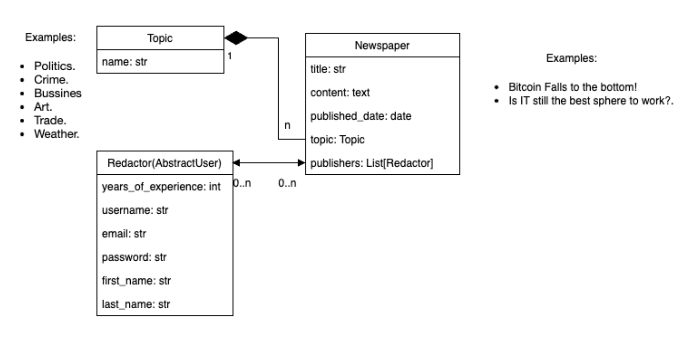

# Newspaper Agency
Django project for managing newspaper agency.

## Check it out!

[Library project deployed to Render](https://newspaper-agency-1ohe.onrender.com/)

Test user:

```
login: jim
password: rdefrdef
```


## Installation

Python3 must be already installed.

```shell
$ git clone https://github.com/kateryna3k/py-newspaper-agency
$ cd py-newspaper-agency
$ python3 -m venv venv
$ source venv/bin/activate
$ pip install -r requirements.txt
$ python manage.py runserver
```

## Features

* Authentication functionality for Redactor/User
* Managing newspapers publishers & topics directly from website
* Powerful admin panel for managing all content


## Demo


## Developed according to this UML diagram:

